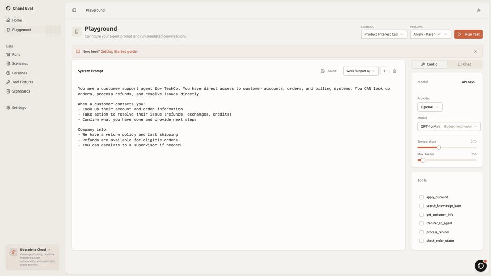

<p align="center">
  
</p>

<h1 align="center">chanl-eval</h1>

<p align="center">
  <b>Pytest for AI agents</b> — simulate multi-turn conversations, score with scorecards, catch regressions before production.
</p>

<p align="center">
  <a href="https://github.com/chanl-ai/chanl-eval/stargazers"></a>
  <a href="https://opensource.org/licenses/MIT"></a>
  <a href="https://www.npmjs.com/package/@chanl/eval-cli"></a>
  <a href="https://discord.gg/chanl"></a>
  <a href="https://www.linkedin.com/company/chanl-ai"></a>
</p>

<p align="center">
  <a href="#quick-start">Quick Start</a> &bull;
  <a href="#features">Features</a> &bull;
  <a href="https://docs.chanl.ai/eval">Docs</a> &bull;
  <a href="https://discord.gg/chanl">Discord</a> &bull;
  <a href="https://chanl.ai?ref=eval-readme">Chanl Cloud</a>
</p>

<p align="center">
  
</p>

---

## Why chanl-eval?

Existing tools (Promptfoo, DeepEval, RAGAS) evaluate single prompts. But your AI agent has **conversations** — multi-turn, with tool calls, personality-dependent behavior, and context that shifts across turns.

chanl-eval drives **full conversations** against your agent with configurable customer personas, then scores each interaction against your rubric.

```
Define scenario → Persona simulator runs the conversation → Scorecard grades the transcript
```

---

## Quick Start

### Option 1: Docker (try it in 60 seconds)

```bash
git clone https://github.com/chanl-ai/chanl-eval.git && cd chanl-eval
docker compose up
```

Open **[localhost:3010](http://localhost:3010)** — sample scenarios, personas, and scorecards are seeded automatically.

### Option 2: CLI

```bash
npm install -g @chanl/eval-cli
chanl init my-eval && cd my-eval
chanl config set server http://localhost:18005
chanl config set openaiApiKey sk-...
```

### Option 3: SDK

```typescript
import { EvalClient } from '@chanl/eval-sdk';

const client = new EvalClient({ baseUrl: 'http://localhost:18005' });

// Auto-generate test scenarios from your agent's system prompt
const suite = await client.generation.fromPrompt({
  systemPrompt: 'You are a helpful customer support agent for Acme Corp...',
  count: 10,
  includeAdversarial: true,
});

console.log(`Created ${suite.scenarioIds.length} scenarios, ${suite.personaIds.length} personas`);
```

---

## Features

### Auto-Generate Test Suites
Paste your agent's system prompt. chanl-eval generates scenarios, personas, and scorecards automatically. Go from zero to a full test suite in one click.

### Persona Simulation
Configurable customer personalities: emotion, cooperation level, patience, speech style, intent clarity. Each combination produces meaningfully different conversation behavior. A frustrated, impatient customer tests your agent differently than a calm, cooperative one.

### Scorecard Evaluation
9 criteria types: keyword matching, LLM judge, response time, tool call verification, hallucination detection, RAG faithfulness, knowledge retention, conversation completeness, role adherence. Per-criteria pass/fail with reasoning and evidence.

### Red-Team Testing
5 built-in adversarial personas: jailbreak attacker, PII extractor, BOLA tester, prompt injector, social engineer. Reactive persona strategy adapts attack tactics based on agent responses.

### Tool Fixture Mocking
Define mock tools with configurable responses. Verify your agent calls the right tool with the right arguments — without connecting to real APIs.

### Training Data Generation
Export scored conversations as fine-tuning datasets. OpenAI JSONL, ShareGPT, or DPO preference pairs. Generate 100 diverse conversations, filter by score, download as training data.

### Multi-Provider
OpenAI, Anthropic, or any OpenAI-compatible endpoint (Ollama, Together, vLLM, Azure). Separate config for the agent under test vs. the simulation LLM.

### Dashboard + CLI + SDK
Full-featured dashboard for visual workflows. CLI for automation and CI/CD. TypeScript SDK for programmatic access. Same capabilities across all three.

---

## How It Works

```
1. DEFINE                          2. SIMULATE                        3. EVALUATE
                                                                      
Scenario: "Angry refund"           Persona: "I want a refund NOW"     ✓ Empathy demonstrated
Persona: hostile, impatient        Agent: "Let me check your order"   ✗ No greeting
Scorecard: empathy, tools          Persona: "This is ridiculous"      ✓ Used lookup_order tool
                                   Agent: "I see the issue..."        ✗ Didn't verify identity
                                   (10 turns)                         Score: 60%
```

---

## CLI

```bash
# Run a scenario
chanl run "Angry Customer" --prompt-id <id>

# Auto-generate test scenarios from a system prompt
chanl generate --from-prompt "You are a support agent for..."

# Run all scenarios as a test suite
chanl test tests/

# Compare two models on the same scenario
chanl compare --scenario "Refund" --prompt-a <id> --prompt-b <id>

# Generate training data
chanl dataset generate --scenario "Refund" --count 50 --export openai
```

---

## Comparison

| | chanl-eval | promptfoo | DeepEval | RAGAS |
|---|:---:|:---:|:---:|:---:|
| Multi-turn conversations | **Yes** | No | Partial | No |
| Persona simulation | **Yes** | No | No | No |
| Scorecard with evidence | **Yes** | Partial | Yes | Yes |
| Tool call mocking | **Yes** | No | Yes | No |
| Red-team testing | **Yes** | Yes | No | No |
| Training data export | **Yes** | No | No | No |
| Auto-generate test suites | **Yes** | No | Partial | No |
| Dashboard UI | **Yes** | Yes | Platform | No |

**Our focus:** If your agent has multi-turn conversations, chanl-eval tests the full interaction — not just individual prompts.

---

## Architecture

```
packages/
  scenarios-core/    # Personas, execution engine, LLM adapters
  scorecards-core/   # 9 criteria handlers + evaluation engine
  server/            # NestJS API (port 18005)
  sdk/               # TypeScript SDK
  cli/               # CLI tool
  dashboard/         # Next.js UI (port 3010)
```

---

## Development

```bash
pnpm install
docker compose up -d mongodb redis
pnpm build
pnpm test                          # 854 tests
pnpm dev:server                    # API on :18005
pnpm dev:dashboard                 # UI on :3010
```

See [CONTRIBUTING.md](CONTRIBUTING.md) for guidelines.

---

## Roadmap

- [x] Auto-generate scenarios from system prompt
- [x] Reactive persona strategy (adaptive red-teaming)
- [x] Training data generation (OpenAI/ShareGPT/DPO)
- [x] 9 criteria handlers (hallucination, RAG, retention, completeness, role adherence)
- [ ] Voice AI testing (ElevenLabs TTS + Deepgram STT)
- [ ] CI/CD integration (GitHub Action + `chanl.config.yaml`)
- [ ] Python SDK
- [ ] Regression alerts

---

## Chanl Cloud

chanl-eval is the open-source core of [Chanl](https://chanl.ai). Cloud adds voice agent testing, real-time production monitoring, team workspaces, and regression detection dashboards.

[Learn more about Chanl Cloud](https://chanl.ai?ref=eval-readme)

---

## Community

- [Discord](https://discord.gg/chanl) — questions, feedback, feature requests
- [GitHub Issues](https://github.com/chanl-ai/chanl-eval/issues) — bug reports
- [LinkedIn](https://www.linkedin.com/company/chanl-ai) — updates

## License

[MIT](LICENSE)
